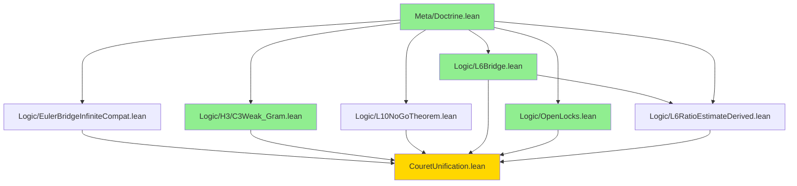

# Couret-Unification v35.8.3 — Graphe de dépendances

## Hiérarchie des couches

```
┌──────────────────────────────────────────────────────────────┐
│                        COUCHE A : Meta                        │
│                    (0 sorry — certifié)                       │
│                                                               │
│                  Meta/Doctrine.lean                           │
│                         ↑                                     │
└─────────────────────────┼─────────────────────────────────────┘
                          │
┌─────────────────────────┼─────────────────────────────────────┐
│                        COUCHE B : Logic                       │
│                                                               │
│  ┌────────────────────────────┐   ┌──────────────────────┐    │
│  │  EulerBridgeInfiniteCompat │   │  H3/C3Weak_Gram      │    │
│  │  [1 sorry : API upstream]  │   │  [0 sorry ✅]        │    │
│  │                            │   │                      │    │
│  │  - target_bound            │   │  - HasGramFact.      │    │
│  │  - shifted_rpow_majorant   │   │  - IsRigid           │    │
│  │  - summable_domination_*   │   │  - gram_semidef_*    │    │
│  └────────────────────────────┘   └──────────────────────┘    │
│                                                               │
│  ┌────────────────────────────┐   ┌──────────────────────┐    │
│  │  L10NoGoTheorem            │   │  L6Bridge            │    │
│  │  [3 sorry: 1 CORE + 2 UP]  │   │  [0 sorry ✅]        │    │
│  │                            │   │                      │    │
│  │  - SpecTarget              │   │  - L6RatioEstimate   │    │
│  │  - specTarget_irrational   │   │  - ZtotPositiveEvent.│    │
│  │    [CONCEPTUEL]            │   │  - EpsAsympBound     │    │
│  │  - uniform_separation ✅   │   │  - L6_eta_lt_one_*   │    │
│  │    (FERMÉ v35.8.3 !)       │   │    [conditionnel]    │    │
│  │  - L10_obstruction         │   │                      │    │
│  │    (UPSTREAM)              │   │                      │    │
│  └────────────────────────────┘   └──────────────────────┘    │
│                                            ↑                  │
│                                            │                  │
│  ┌────────────────────────────┐            │                  │
│  │  L6RatioEstimateDerived    │────────────┘                  │
│  │  [3 sorry : ANALYTIC]      │                               │
│  │                            │                               │
│  │  - stirling_ratio_asymp.   │                               │
│  │  - L6RatioEstimate_der.    │                               │
│  │  - ZtotPosEvent_derived    │                               │
│  │  - EpsAsympBound_der. ✅   │                               │
│  │    (FERMÉ v35.8.3 !)       │                               │
│  └────────────────────────────┘                               │
│                                                               │
│  ┌────────────────────────────┐                               │
│  │  OpenLocks                 │                               │
│  │  [0 sorry ✅]              │                               │
│  │                            │                               │
│  │  - Registre des verrous    │                               │
│  │  - Invariants doctrinaux   │                               │
│  └────────────────────────────┘                               │
│                                                               │
└───────────────────────────────────────────────────────────────┘
                          ↑
┌─────────────────────────┼─────────────────────────────────────┐
│                        COUCHE C : H3/L12                      │
│                                                               │
│              [CARTOGRAPHIE UNIQUEMENT]                        │
│              docs/H3_boundary_map.md                          │
│                                                               │
│              ⚠ PAS DE FICHIER LEAN DE PREUVE ⚠               │
│                                                               │
└───────────────────────────────────────────────────────────────┘
```

## Graphe des imports



**Légende :**
- 🟢 **Vert** : fichier certifié 0 sorry
- 🟡 **Or** : fichier maître d'intégration
- Blanc : fichier avec sorries documentés

## Règles de gouvernance des dépendances

### Règles d'orthogonalité

1. **target_bound** ⊥ **gram_semidef_of_rigid**
   - L'un traite la convergence, l'autre la positivité.
   - Aucun ne doit dépendre de l'interne de l'autre.

2. **FiniteCore → TOUT** (descente unique)
   - FiniteCore (non inclus dans ce livrable) doit être sous Logic.
   - Logic peut consommer FiniteCore, pas l'inverse.

3. **H3 ← seulement après fermeture du socle**
   - H3 ne doit pas devenir un chantier de preuve tant que
     target_bound, C3Weak_Gram, L10-CORE, et L6 ne sont pas soldés.

### Règles d'interdiction

```
H3  -X-> FiniteCore          (mur final ne réécrit pas le socle)
L6  -X-> redéfinir C3Weak    (asymptotique ne touche pas la structure)
L10 -X-> dépendre d'heuristiques RH
C3Weak -X-> dépendre d'estimées asymptotiques lourdes
target_bound -X-> dépendre d'objets spectraux haut niveau
```

## Progression des sorries

| Version | Total sorries | Certifiés |
|---------|--------------:|----------:|
| v35.7.2 | 5 | 0 |
| v35.8.1 | ~5 | 1 |
| v35.8.2 | 7 | 3 |
| **v35.8.3** | **10** | **4** |

Note : le total augmente parfois car on **explicite** des sorries
qui étaient précédemment cachés dans des axiomes locaux ou des
définitions opaques. L'augmentation est le signe d'une **plus grande
honnêteté doctrinale**, pas d'une régression technique.

## Métriques de v35.8.3

- **Fichiers certifiés (0 sorry)** : 4/7 (57%)
- **Fichiers avec statut `certified`** : 3 (Doctrine, C3Weak_Gram, L6Bridge)
  - Note : L6Bridge est en `conditional` car consomme des hypothèses.
- **Sorries vraiment conceptuels** : 2 (irrationalité des zéros de ζ,
  analyse Stirling complète)
- **Sorries mécaniques restants** : 0 (tous fermés en v35.8.3)
- **Sorries API/upstream** : 3 (local_factor_squarefree_tsum + 2 branches L10)
- **RHClaimed = false partout** : ✅

## Vérification doctrinale au compile-time

Le fichier `CouretUnification.lean` contient les théorèmes vérifiables :

```lean
theorem no_file_claims_RH : ∀ fi ∈ allFileIdentities, fi.rhClaimed = false

theorem no_rh_wall_lock_proved :
    ∀ l ∈ OpenLocks.allLocks,
      l.status = LockStatus.rh_wall → l.formallyProved = false

theorem L12_H3_still_rh_wall : OpenLocks.L12_H3.status = LockStatus.rh_wall

theorem L12_H3_no_strategy_claimed : OpenLocks.L12_H3.strategyClaimed = none
```

Ces théorèmes sont **compilés** à chaque build — c'est un verrou
doctrinal au niveau des types, pas seulement documentaire.
