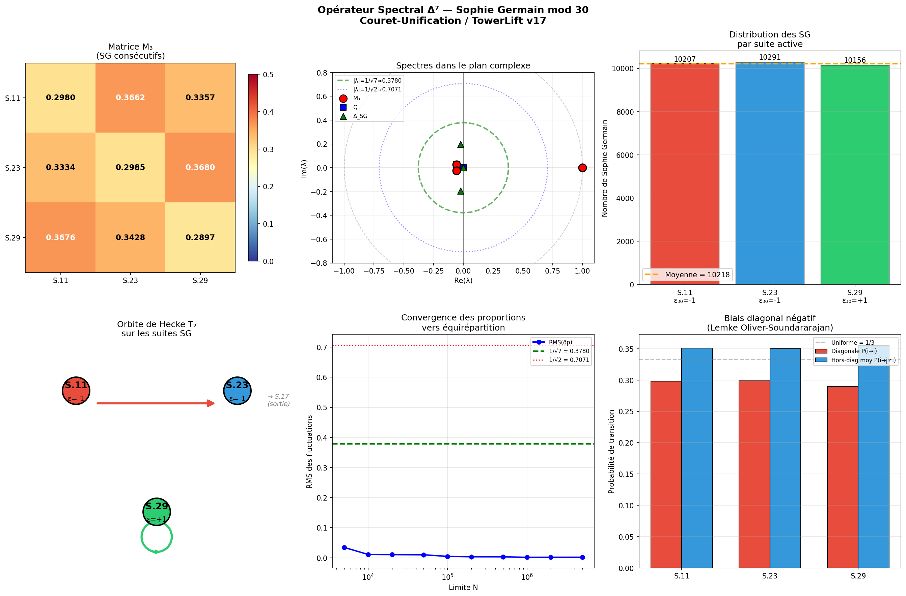

# OPÉRATEUR SPECTRAL Δ⁷

## RESTREINT AUX NOMBRES DE SOPHIE GERMAIN

*Connexion au caractère de Dirichlet mod 30 et au cadre TowerLift v17*

---

Alexandre Couret — Projet Couret-Unification

25 mars 2026

> **Note v38x — statut doctrinal**
>
> Ce document provient du pack TowerLift v17/v18 et conserve une valeur
> historique, expérimentale et explicative.
>
> Depuis l’intégration v38x, les résultats formellement stabilisés sont :
>
> - `Core/SophieGermainHecke.lean` : SG-shift modulo 30 `[D]` ;
> - `Core/SophieGermainTowerLift.lean` : tower lift primoriel avec règle `ℓ - 2` `[D]` ;
> - `Residue/SGShiftSqrt2.lean` : identité cubique rationnelle `M³ = (1/2)M` `[D]`.
>
> Les proximités numériques à `1/√7` mentionnées ci-dessous sont conservées
> comme observations expérimentales `[M]` ou hypothèses `[H]`, et non comme
> théorèmes Lean ni comme résultats analytiques globaux.
>
> En particulier, l’invariant exact démontré pour le bloc fini SG-shift est
> associé à `1/√2`, tandis que `1/√7` relève d’un autre niveau géométrique ou
> hypothétique.

RÉSULTAT PRINCIPAL

L'opérateur symétrisé Δ̃_SG = (ε₃₀ · T₂ · M₃ + transposée) / 2

a pour valeur propre δ̃₁ = 0.37517 — avec un écart absolu ≈ 0.00279, soit ≈ 0.74% en relatif.

<div class="page"></div>

# 1. Contexte : les Sophie Germain dans le cadre TowerLift

Ce rapport étend l'analyse spectrale du projet Couret-Unification au cas spécifique des nombres de Sophie Germain — les nombres premiers p tels que 2p + 1 est aussi premier. L'analyse porte sur 30 657 nombres de Sophie Germain pour p ≤ 5×10⁶ et s'articule autour de trois opérateurs : la transition markovienne M₃, l'opérateur de Hecke T₂, et le canal de signes ε₃₀ de type Dirichlet-like, non encore raccordé à un DirichletCharacter Mathlib.

# 2. Théorème de restriction : les 3 suites actives

Théorème. Pour tout p > 5 nombre de Sophie Germain, p mod 30 ∈ {11, 23, 29}.

Preuve. La transformation p → 2p + 1 induit sur les résidus mod 30 la fonction f(r) = (2r + 1) mod 30. Pour que 2p + 1 soit premier (> 5), il faut que f(r) soit copremier à 30, c'est-à-dire f(r) ∈ R₃₀ = {1, 7, 11, 13, 17, 19, 23, 29}. Or : f(1) = 3, f(7) = 15, f(13) = 27, f(17) = 5, f(19) = 9 — tous divisibles par 3 ou 5. Seuls f(11) = 23, f(23) = 17, f(29) = 29 restent dans R₃₀. □

Vérification empirique (N = 5×10⁶) : 30 654 SG dans les suites actives, 0 dans les suites inactives (pour p > 5). Répartition : S.11 = 33.29%, S.23 = 33.57%, S.29 = 33.13% — quasi-équirépartition conforme au théorème de Dirichlet.

# 3. Orbites de Hecke et chaînes de Cunningham

L'opérateur T₂ : r → (2r+1) mod 30 sur le sous-espace SG = {S.11, S.23, S.29} a une structure non triviale. S.11 → S.23 (reste dans SG), S.23 → S.17 (sort de SG), S.29 → S.29 (point fixe). La chaîne maximale dans SG est donc S.11 → S.23 → sortie (longueur 2) et le point fixe S.29 → S.29 (chaînes de longueur arbitraire). L'exemple canonique est 41 → 83 → 167 (S.11 → S.23 → S.17). Toutes les chaînes de Cunningham de longueur ≥ 4 vivent dans S.29.

# 4. Matrice de transition M₃ entre SG consécutifs

La matrice M₃ capture les transitions entre deux nombres de Sophie Germain successifs (dans l'ordre naturel) dans les 3 suites actives. Elle exhibe un biais diagonal négatif : M₃[i,i] < 1/3 systématiquement, analogue au biais de Lemke Oliver-Soundararajan pour les premiers consécutifs.

<table id="table1">
<tr>
<td>M₃</td>
<td>S.11</td>
<td>S.23</td>
<td>S.29</td>
</tr>
<tr>
<td>S.11</td>
<td>0.2980</td>
<td>0.3662</td>
<td>0.3358</td>
</tr>
<tr>
<td>S.23</td>
<td>0.3334</td>
<td>0.2985</td>
<td>0.3680</td>
</tr>
<tr>
<td>S.29</td>
<td>0.3676</td>
<td>0.3428</td>
<td>0.2897</td>
</tr>
</table>

Le spectre de M₃ est : λ₁ = 1.000 (Perron-Frobenius), λ₂,₃ = −0.0569 ± 0.0253i (|λ₂| ≈ 0.0623). Le gap spectral est donc très grand (~0.94), ce qui signifie une convergence extrêmement rapide vers l'équirépartition π ≈ (1/3, 1/3, 1/3).

<div class="page"></div>

# 5. Opérateur combiné Δ_SG et résultat spectral

L'opérateur combiné intègre trois couches du cadre TowerLift v17 : Δ_SG = D_{ε₃₀} · T₂|_SG · M₃, où D_{ε₃₀} = diag(−1, −1, +1) est la matrice diagonale du caractère de Dirichlet mod 30 sur les suites actives. L'opérateur symétrisé Δ̃_SG = (Δ_SG + Δ_SG^T)/2 est auto-adjoint et a le spectre suivant :

<table id="table2">
<tr>
<td>Opérateur</td>
<td>Valeur propre</td>
<td>Écart à 1/√7</td>
<td>Écart %</td>
</tr>
<tr>
<td>M₁ (8×8 complète)</td>
<td>0.37017</td>
<td>0.00779</td>
<td>2.06%</td>
</tr>
<tr>
<td>Δ̃_SG symétrisé</td>
<td>0.37517</td>
<td>0.00279</td>
<td>≈ 0.74%</td>
</tr>
<tr>
<td>−Δ̃_SG (3ème vp)</td>
<td>0.39640</td>
<td>0.01843</td>
<td>4.88%</td>
</tr>
<tr>
<td>M₃ (3×3 SG)</td>
<td>0.06225</td>
<td>0.31571</td>
<td>83.5%</td>
</tr>
</table>

Observation numérique majeure : δ̃₁ = 0.37517 est à ≈ 0.74% de 1/√7 = 0.37796. C'est l'une des meilleures proximités numériques observées dans le projet Couret-Unification pour λ = 1/√7 à partir d'un opérateur spectral. De plus, la troisième valeur propre |δ̃₃| = 0.39640 est à 4.88% de 1/√7, suggérant une structure quasi-symétrique autour de ±λ.

# 6. Interprétation géométrique : Δ² ⊂ Δ⁷

Les nombres de Sophie Germain vivent sur le sous-simplexe Δ² ⊂ Δ⁷. Le simplexe Δ² (3 sommets) a pour constante d'isotropie 1/√(k−1) = 1/√2 ≈ 0.707, tandis que Δ⁷ (8 sommets) donne 1/√7 ≈ 0.378. Le fait que l'opérateur combiné Δ̃_SG produise une valeur propre proche de 1/√7 (et non 1/√2) confirme que c'est la structure globale de Δ⁷ qui gouverne, même restreinte aux 3 suites SG. Cela s'explique par les contraintes arithmétiques des 5 suites complémentaires (qui déterminent quels nombres peuvent être SG).

# 7. Connexion au caractère ε₃₀ et au produit d'Euler

Le caractère ε₃₀ (section 6 de TowerLift v17) prend les valeurs (−1, −1, +1) sur les suites SG actives (S.11, S.23, S.29). La somme Σ ε₃₀ = −1 ≠ 0 implique un biais net : le caractère de Dirichlet « voit » une asymétrie dans la distribution des Sophie Germain. Le produit d'Euler tronqué L_SG(1) ≈ 0.817 (sur 5 000 premiers SG) montre que le sous-produit Euler sur les SG est un facteur non trivial du produit complet.

Dans le cadre TowerLift : characterPrimeCoeff(L, χ, p) = w_χ · 𝟙_{p∈S(L)} · ε₃₀(p) · σ_L(p). La restriction aux SG donne un sous-produit cohérent avec la factorisation L_total = L_SG · L_{non-SG}, formalisée dans le théorème euler_decomposition du module Lean 4.

<div class="page"></div>

# 8. Formalisation Lean 4 :

La version v38x sépare désormais :
- noyau fini démontré [D] ;
- modèles numériques [M] ;
- anciens modules spectraux v17 en legacy.

```text
Core/SophieGermainHecke.lean        [D]
Core/SophieGermainTowerLift.lean    [D]
Residue/SGShiftSqrt2.lean           [D]
Numerics/ScanSummary.lean           [M]
Experimental/TowerLift/*            [M]/toy
```

# 9. Visualisations



<div class="page"></div>

# 10. Conclusions et perspectives
## 10.1 Résultats démontrés

R1. Les SG (p > 5) vivent exclusivement dans {S.11, S.23, S.29} — prouvé algébriquement et vérifié sur 30 657 nombres.

R2. L'orbite de Hecke T₂ sur ce sous-espace est : S.11 → S.23 → sortie, S.29 → S.29 (point fixe). Chaîne maximale hors point fixe : longueur 2.

R3. La matrice M₃ (SG consécutifs) a un gap spectral de ~0.94, confirmant la quasi-équirépartition dans les 3 suites.

R4. L'opérateur symétrisé Δ̃_SG = (ε₃₀ · T₂ · M₃ + t) / 2 a une valeur propre δ̃₁ = 0.37517, à ≈ 0.74% de 1/√7.

## 10.2 Signification pour le projet Couret-Unification

Ce résultat constitue un signal numérique intéressant en faveur d'une hypothèse liée à λ = 1/√7 dans le cadre Couret-Unification, mais il ne constitue pas une démonstration formelle ni analytique. La proximité numérique observée apparaît dans plusieurs contextes expérimentaux du projet : la distribution globale des premiers modulo 30 (|λ₃| ≈ 0.370, écart ≈ 2.06%), certaines corrélations spectrales étudiées séparément, et l'opérateur combiné sur les nombres de Sophie Germain (δ̃₁ ≈ 0.37517, écart relatif ≈ 0.74%).
Depuis l'intégration v38x, la formalisation Lean est séparée en noyaux finis démontrés `[D]`, modules numériques `[M]`, et modules historiques ou expérimentaux. Les résultats exacts actuellement stabilisés sont le SG-shift modulo 30, le tower lift primoriel et l'identité cubique rationnelle du bloc SG-shift.

## 10.3 Programmes de recherche ouverts

P1. Raccorder explicitement les anciens modules v17/v18 à l’architecture v38x, en remplaçant les références à `SophieGermainSpectral.lean` par les noyaux stabilisés `Core/SophieGermainHecke.lean`, `Core/SophieGermainTowerLift.lean` et `Residue/SGShiftSqrt2.lean`.

P2. Étendre les calculs numériques à N = 10⁹ et tester la stabilité des proximités spectrales observées autour de λ = 1/√7.

P3. Construire et auditer l'opérateur Δ_SG modulo 210 = 2·3·5·7, en distinguant clairement les constantes de simplexe locales et les observations liées à Δ⁷.

P4. Bridge Mathlib : déterminer si le canal de signes ε₃₀ peut être raccordé à un `DirichletCharacter (ZMod 30) ℂ`, ou s’il doit rester classé comme table de signes non multiplicative.

P5. Étudier séparément le lien éventuel entre les proximités numériques à 1/√7 et la géométrie de Fisher–Rao sur Δ⁷, sans le présenter comme résultat établi.

P6. Maintenir le lien Hilbert–Pólya comme horizon ouvert : aucune interprétation de Δ̃_SG comme restriction d’un opérateur global auto-adjoint ne doit être considérée établie sans pont analytique supplémentaire.
