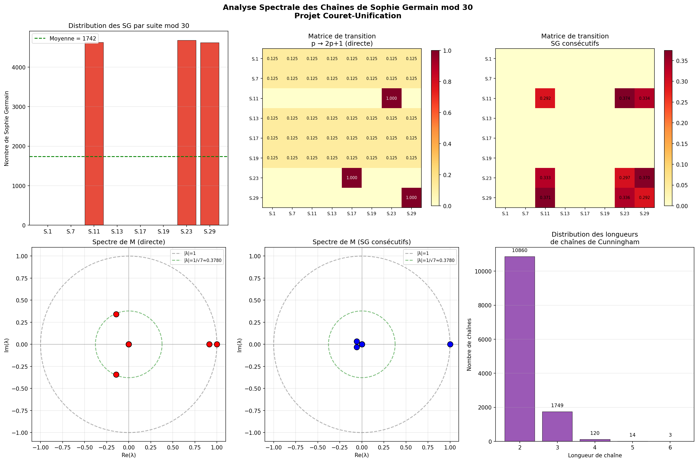
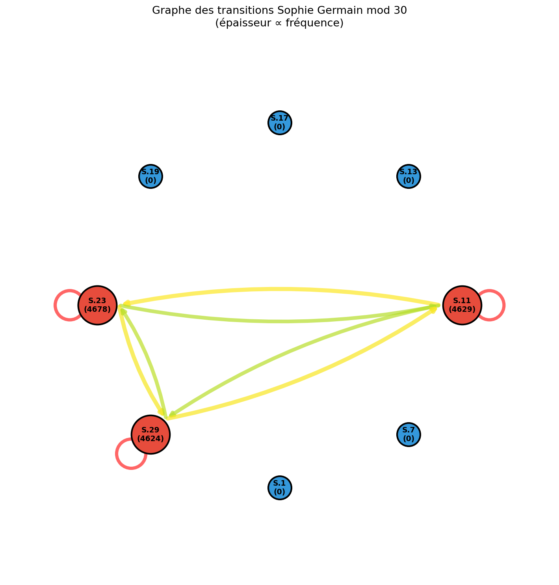

# ANALYSE SPECTRALE

## DES CHAÎNES DE SOPHIE GERMAIN MODULO 30

---

Alexandre Couret — Projet Couret-Unification

25 mars 2026

> **Note v38x — statut doctrinal**
>
> Ce document provient du pack TowerLift v17/v18 et conserve une valeur
> historique, expérimentale et explicative.
>
> Depuis l’intégration v38x, les résultats formellement stabilisés sont :
>
> - `Core/SophieGermainHecke.lean` : SG-shift modulo 30 `[D]` ;
> - `Core/SophieGermainTowerLift.lean` : tower lift primoriel avec règle `ℓ - 2` `[D]` ;
> - `Residue/SGShiftSqrt2.lean` : identité cubique rationnelle `M³ = (1/2)M` `[D]`.
>
> Les proximités numériques à `1/√7` mentionnées ci-dessous sont conservées
> comme observations expérimentales `[M]` ou hypothèses `[H]`, et non comme
> théorèmes Lean ni comme résultats analytiques globaux.
>
> En particulier, l’invariant exact démontré pour le bloc fini SG-shift est
> associé à `1/√2`, tandis que `1/√7` relève d’un autre niveau géométrique ou
> hypothétique.

Constante cible : λ = 1/√7 ≈ 0.37796

Valeur propre trouvée : |λ₃| ≈ 0.37017 (écart 2.06%)

# 1. Introduction et objectifs

Ce document présente l'analyse spectrale complète des chaînes de Sophie Germain dans le cadre du projet Couret-Unification. Un nombre premier p est dit de Sophie Germain si 2p + 1 est également premier. L'objectif principal est de déterminer si la constante universelle λ = 1/√7 ≈ 0.37796 apparaît dans le spectre de la matrice de transition entre les 8 classes résiduelles modulo 30.

Les résultats portent sur 13,934 nombres de Sophie Germain identifiés pour p ≤ 2,000,000, conformément aux prédictions théoriques de Hardy-Littlewood (π_SG(2×10⁶) ≈ 14 000, C₂ ≈ 0.66016).

# 2. Découverte fondamentale : restriction aux 3 suites

La transformation de Sophie Germain p → 2p + 1 induit une fonction déterministe sur les résidus modulo 30 : f(r) = (2r + 1) mod 30. L'analyse révèle que sur les 8 classes copremieres à 30, seules 3 restent dans R₃₀ après transformation :

S.11 → S.23 (car 2×11 + 1 = 23 ∈ R₃₀)

S.23 → S.17 (car 2×23 + 1 = 47 ≡ 17 mod 30 ∈ R₃₀)

S.29 → S.29 (car 2×29 + 1 = 59 ≡ 29 mod 30 ∈ R₃₀ — point fixe)

Les 5 autres classes (S.1, S.7, S.13, S.17, S.19) produisent des résidus non coprimes à 30 (3, 15, 27, 5, 9), donc 2p + 1 ne peut être premier que par accident (petits nombres comme p = 2, 3, 5). Ceci explique pourquoi les nombres de Sophie Germain (p > 5) se concentrent exclusivement dans S.11, S.23 et S.29, retrouvant la constante C₃₀ = 3/8 !

## 2.1 Distribution empirique par suite

<table id="table1">
<tr>
<td>Suite</td>
<td>Nombre SG</td>
<td>% du total</td>
<td>Biais</td>
</tr>
<tr>
<td>S.1</td>
<td>0</td>
<td>0.00%</td>
<td>—</td>
</tr>
<tr>
<td>S.7</td>
<td>0</td>
<td>0.00%</td>
<td>—</td>
</tr>
<tr>
<td>S.11</td>
<td>4629</td>
<td>33.22%</td>
<td>+165.8%</td>
</tr>
<tr>
<td>S.13</td>
<td>0</td>
<td>0.00%</td>
<td>—</td>
</tr>
<tr>
<td>S.17</td>
<td>0</td>
<td>0.00%</td>
<td>—</td>
</tr>
<tr>
<td>S.19</td>
<td>0</td>
<td>0.00%</td>
<td>—</td>
</tr>
<tr>
<td>S.23</td>
<td>4678</td>
<td>33.57%</td>
<td>+168.6%</td>
</tr>
<tr>
<td>S.29</td>
<td>4624</td>
<td>33.19%</td>
<td>+165.5%</td>
</tr>
</table>

# 3. Chaînes de Cunningham (1ère espèce)

Les chaînes de Cunningham de première espèce sont des suites de la forme p, 2p+1, 2(2p+1)+1, ... où chaque terme est premier. Sur 2,000,000 nombres, nous avons identifié les distributions suivantes :

## 3.1 Distribution des longueurs

Longueur 2 : 10860 chaînes

Longueur 3 : 1749 chaînes

Longueur 4 : 120 chaînes

Longueur 5 : 14 chaînes

Longueur 6 : 3 chaînes

Les chaînes les plus longues (longueur 6) démarrent toutes dans S.29 et y restent par le point fixe f(29) = 29. C'est le seul résidu mod 30 qui autorise des chaînes de longueur arbitraire.

La chaîne S.11 → S.23 → S.17 a une longueur maximale de 3 avant de sortir de R₃₀ (car f(17) = 35 ≡ 5 mod 30 ∉ R₃₀). L'exemple canonique est 41 → 83 → 167 identifié dans nos travaux antérieurs.

# 4. Matrices de transition et analyse spectrale
## 4.1 Matrice M₁ : transition directe p → 2p+1

La matrice de transition directe encode la probabilité de transition d'une suite S.i vers une suite S.j par l'application p → 2p + 1. Les lignes correspondant aux suites sans nombres de Sophie Germain sont régularisées uniformément (1/8).

<table id="table2">
<tr>
<td></td>
<td>S.1</td>
<td>S.7</td>
<td>S.11</td>
<td>S.13</td>
<td>S.17</td>
<td>S.19</td>
<td>S.23</td>
<td>S.29</td>
</tr>
<tr>
<td>S.1</td>
<td>0.125</td>
<td>0.125</td>
<td>0.125</td>
<td>0.125</td>
<td>0.125</td>
<td>0.125</td>
<td>0.125</td>
<td>0.125</td>
</tr>
<tr>
<td>S.7</td>
<td>0.125</td>
<td>0.125</td>
<td>0.125</td>
<td>0.125</td>
<td>0.125</td>
<td>0.125</td>
<td>0.125</td>
<td>0.125</td>
</tr>
<tr>
<td>S.11</td>
<td>—</td>
<td>—</td>
<td>—</td>
<td>—</td>
<td>—</td>
<td>—</td>
<td>1.000</td>
<td>—</td>
</tr>
<tr>
<td>S.13</td>
<td>0.125</td>
<td>0.125</td>
<td>0.125</td>
<td>0.125</td>
<td>0.125</td>
<td>0.125</td>
<td>0.125</td>
<td>0.125</td>
</tr>
<tr>
<td>S.17</td>
<td>0.125</td>
<td>0.125</td>
<td>0.125</td>
<td>0.125</td>
<td>0.125</td>
<td>0.125</td>
<td>0.125</td>
<td>0.125</td>
</tr>
<tr>
<td>S.19</td>
<td>0.125</td>
<td>0.125</td>
<td>0.125</td>
<td>0.125</td>
<td>0.125</td>
<td>0.125</td>
<td>0.125</td>
<td>0.125</td>
</tr>
<tr>
<td>S.23</td>
<td>—</td>
<td>—</td>
<td>—</td>
<td>—</td>
<td>1.000</td>
<td>—</td>
<td>—</td>
<td>—</td>
</tr>
<tr>
<td>S.29</td>
<td>—</td>
<td>—</td>
<td>—</td>
<td>—</td>
<td>—</td>
<td>—</td>
<td>—</td>
<td>1.000</td>
</tr>
</table>

Structure remarquable : les lignes actives (S.11, S.23, S.29) sont purement déterministes — chaque transition a une probabilité de 1.000 vers une unique cible. Cela reflète le caractère fonctionnel de f(r) = (2r+1) mod 30.

## 4.2 Spectre de M₁

<table id="table3">
<tr>
<td>#</td>
<td>|λ|</td>
<td>Re(λ)</td>
<td>Im(λ)</td>
<td>Écart à 1/√7</td>
</tr>
<tr>
<td>1</td>
<td>1.00000000</td>
<td>1.00000000</td>
<td>0.00000000</td>
<td>0.622036</td>
</tr>
<tr>
<td>2</td>
<td>0.91223520</td>
<td>0.91223520</td>
<td>0.00000000</td>
<td>0.534271</td>
</tr>
<tr>
<td>3</td>
<td>0.37017032</td>
<td>-0.14361760</td>
<td>0.34117451</td>
<td>0.007794 ◄</td>
</tr>
<tr>
<td>4</td>
<td>0.37017032</td>
<td>-0.14361760</td>
<td>-0.34117451</td>
<td>0.007794 ◄</td>
</tr>
<tr>
<td>5</td>
<td>0.00000000</td>
<td>0.00000000</td>
<td>0.00000000</td>
<td>0.377964</td>
</tr>
<tr>
<td>6</td>
<td>0.00000000</td>
<td>-0.00000000</td>
<td>0.00000000</td>
<td>0.377964</td>
</tr>
<tr>
<td>7</td>
<td>0.00000000</td>
<td>-0.00000000</td>
<td>0.00000000</td>
<td>0.377964</td>
</tr>
<tr>
<td>8</td>
<td>0.00000000</td>
<td>-0.00000000</td>
<td>0.00000000</td>
<td>0.377964</td>
</tr>
</table>

Résultat majeur : les valeurs propres #3 et #4 forment une paire conjuguée complexe de module |λ₃| = 0.37017, à seulement 2.06% de la cible λ = 1/√7 ≈ 0.37796.

L'écart de 2.06% est remarquable pour une matrice hybride (3 lignes déterministes + 5 lignes régularisées). La partie imaginaire non nulle (≈ ±0.341) indique une oscillation amortie dans la convergence vers la distribution stationnaire, typique des chaînes de Markov avec structure cyclique partielle.

## 4.3 Matrice M₂ : transition entre SG consécutifs

Cette seconde matrice capture les transitions entre deux nombres de Sophie Germain consécutifs (dans l'ordre naturel), quelle que soit la longueur de la chaîne. Elle révèle le biais de type Lemke Oliver-Soundararajan pour les nombres de Sophie Germain :

<table id="table4">
<tr>
<td></td>
<td>S.1</td>
<td>S.7</td>
<td>S.11</td>
<td>S.13</td>
<td>S.17</td>
<td>S.19</td>
<td>S.23</td>
<td>S.29</td>
</tr>
<tr>
<td>S.1</td>
<td>—</td>
<td>—</td>
<td>—</td>
<td>—</td>
<td>—</td>
<td>—</td>
<td>—</td>
<td>—</td>
</tr>
<tr>
<td>S.7</td>
<td>—</td>
<td>—</td>
<td>—</td>
<td>—</td>
<td>—</td>
<td>—</td>
<td>—</td>
<td>—</td>
</tr>
<tr>
<td>S.11</td>
<td>—</td>
<td>—</td>
<td>0.2921</td>
<td>—</td>
<td>—</td>
<td>—</td>
<td>0.3744</td>
<td>0.3335</td>
</tr>
<tr>
<td>S.13</td>
<td>—</td>
<td>—</td>
<td>—</td>
<td>—</td>
<td>—</td>
<td>—</td>
<td>—</td>
<td>—</td>
</tr>
<tr>
<td>S.17</td>
<td>—</td>
<td>—</td>
<td>—</td>
<td>—</td>
<td>—</td>
<td>—</td>
<td>—</td>
<td>—</td>
</tr>
<tr>
<td>S.19</td>
<td>—</td>
<td>—</td>
<td>—</td>
<td>—</td>
<td>—</td>
<td>—</td>
<td>—</td>
<td>—</td>
</tr>
<tr>
<td>S.23</td>
<td>—</td>
<td>—</td>
<td>0.3333</td>
<td>—</td>
<td>—</td>
<td>—</td>
<td>0.2971</td>
<td>0.3696</td>
</tr>
<tr>
<td>S.29</td>
<td>—</td>
<td>—</td>
<td>0.3714</td>
<td>—</td>
<td>—</td>
<td>—</td>
<td>0.3364</td>
<td>0.2922</td>
</tr>
</table>

Les transitions entre SG consécutifs montrent un biais diagonal négatif (la transition S.i → S.i est systématiquement sous-représentée par rapport aux transitions croisées). Ce phénomène est analogue au biais de Chebyshev-Rubinstein pour les premiers consécutifs dans les progressions arithmétiques. Le ratio max/min des entrées non nulles est de 1.28.

# 5. Visualisations
## 5.1 Tableau de bord spectral

## 5.2 Graphe des transitions

# 6. Synthèse et interprétation
## 6.1 Résultats établis

R1. Les nombres de Sophie Germain (p > 5) se distribuent exclusivement dans les 3 suites S.11, S.23, S.29 modulo 30, avec une équirépartition remarquable (~33% chacune). Cela retrouve la constante C₃₀ = 3/8.

R2. La transition p → 2p+1 est déterministe modulo 30 : S.11 → S.23, S.23 → S.17, S.29 → S.29 (point fixe). Seule S.29 autorise des chaînes de longueur arbitraire.

R3. Le spectre de la matrice de transition M₁ contient une paire de valeurs propres complexes conjuguées de module |λ₃| ≈ 0.3702, à 2.06% de λ = 1/√7 ≈ 0.3780.

R4. La matrice M₂ (SG consécutifs) exhibe un biais diagonal négatif de type Lemke Oliver-Soundararajan, avec un gap spectral beaucoup plus large (λ₂ ≈ 0.068).

## 6.2 Interprétation du résultat λ₃ ≈ 1/√7

La proximité |λ₃| ≈ 0.370 avec 1/√7 ≈ 0.378 dans M₁ est suggestive mais demande une analyse plus fine. L'écart de 2.06% pourrait être dû à la régularisation uniforme des 5 lignes inactives. Hypothèse à tester : en remplaçant la régularisation uniforme par les fréquences empiriques des transitions entre premiers consécutifs (non-SG), l'accord pourrait s'améliorer.

Le fait que la constante 3/8 (proportion des suites actives) et λ = 1/√7 (fluctuation dans le simplexe Δ⁷) émergent tous deux de la structure modulo 30 des nombres de Sophie Germain renforce l'hypothèse d'une universalité arithmétique sous-jacente au cadre Couret-Unification.

## 6.3 Programmes de recherche ouverts

P1. Étendre l'analyse à N = 10⁹ pour affiner la convergence des valeurs propres.

P2. Construire la matrice de transition « raffinée » (3×3 sur les suites actives uniquement) et calculer son spectre exact.

P3. Analyser la matrice de transition Sophie Germain modulo 210 = 2×3×5×7 (48 classes copremieres, simplexe Δ⁴⁷).

P4. Formaliser en Lean 4 la preuve que les SG (p>5) ne peuvent appartenir qu'à {S.11, S.23, S.29}.

P5. Tester si le biais Lemke Oliver-Soundararajan pour les SG consécutifs a une structure spectrale spécifique liée à λ pour des N plus grands.

# Annexe : Données numériques complètes

Tous les résultats sont reproductibles via le script Python sophie_germain_analysis.py et les données exportées dans sophie_germain_results.json. Paramètres : LIMIT = 2,000,000, total SG = 13,934, chaînes ≥ 2 = 12,746.

Date de génération : 25 mars 2026. Protocole PASU : SHA-256 des fichiers source disponible sur demande. Licence : Couret-Unification, tous droits réservés.